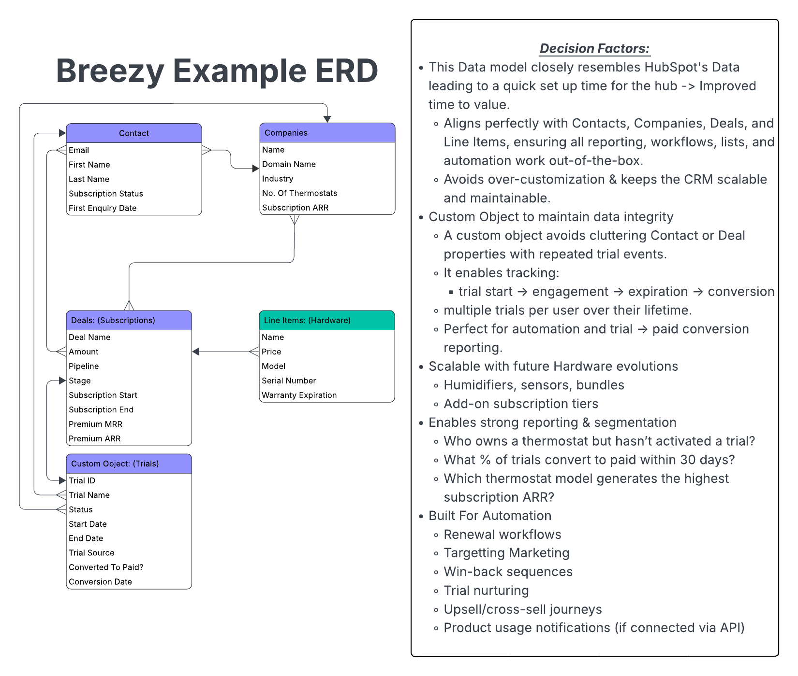

# 📘 **Breezy Admin Panel – Technical Assessment**

<p align="center">
  
</p>

A lightweight CRM-style admin panel for managing **contacts**, **deals**, and generating **AI-powered insights** using HubSpot data.

This proof of concept demonstrates:

* Contact + deal flows
* HubSpot association handling
* Paginated dashboards
* A Gemini-powered AI summary
* Clean, responsive UI

---

# ---

# 🅐 **Setup Instructions**

### 🔧 How to Run Locally

1. **Clone the repository**

   ```bash
   git clone https://github.com/markathubspot-ctrl/ASA-Tech-Assessment
   cd <your-repo>
   ```

2. **Install dependencies**

   ```bash
   npm install
   ```

3. **Create your `.env` file**

   ```env
   HUBSPOT_ACCESS_TOKEN=your_hubspot_private_app_token
   GEMINI_API_KEY=your_google_gemini_api_key
   ```

4. **Start the server**

   ```bash
   npm start
   ```

5. Visit the application:
   👉 [http://localhost:3001](http://localhost:3001)

---

### 📦 Dependencies / Prerequisites

* **Node.js 18+**
* HubSpot Private App with scopes:

  * `crm.objects.contacts.read`
  * `crm.objects.contacts.write`
  * `crm.objects.deals.read`
  * `crm.objects.deals.write`
* Google Gemini API key (optional — required only for AI insights)

---

### 🔐 Expected Environment Variables

| Variable               | Used For                               | Required?                                         |
| ---------------------- | -------------------------------------- | ------------------------------------------------- |
| `HUBSPOT_ACCESS_TOKEN` | Authenticating requests to HubSpot CRM | ✅ Yes                                             |
| `GEMINI_API_KEY`       | AI insights generation                 | ⚠️ Optional (fallback summary is used if missing) |

---

### 🧪 How to Test the Integration Flow

1. **Load contacts**

   * Page loads the **50 most recent HubSpot contacts**, sorted by `createdate DESC`.

2. **Create a contact**

   * Fill the form (top right).
   * New contact appears in the list after refresh.

3. **Create a deal**

   * Select a contact from the dropdown.
   * Create a deal.
   * Selecting the contact in the table shows the associated deals.

4. **View contact → deal relationships**

   * Click **View** next to a contact.

5. **Generate AI Insights**

   * At the top, click **Generate Insights**.
   * Backend fetches:

     * 5 most recent contacts
     * All associated deals
   * Gemini generates a summary **or** a fallback summary is used.

---

# ---

# 🅑 **Project Overview**

This Proof of Concept demonstrates how Breezy could integrate directly with **HubSpot CRM** to:

* Display and manage contacts
* Create and associate deals
* Visualize contact→deal relationships
* Add intelligent insights on top of CRM data

The UI mirrors familiar CRM layouts: contacts on the left, forms on the right, and deals displayed in a structured table.

---

# ---

# 🅒 **AI Usage Documentation**

### 🤖 Which AI tools did you use?

* ChatGPT
* Gemini

### 🧠 What tasks did you use AI for?

* Getting an overview and summary of the issue
* Compiling recommended next steps for the tasks involved
* Generating and refining code

### 📚 What did you learn? What was challenging?

* I found the set up tricky to get everything running correctly and configured
* Once set up, I found the prompt creation for AI tricky as you needed to be precise with the requirements

### ⚙️ How did AI help (or not help)?

**Helped:**

* Got me pointed in the right direction to begin looking into the assessment tasks
* Helped ensure I had my machine configured
* Generate and refine the code

**Limitations:**

* Model availability and naming inconsistencies.
* The AI is great for providing output and recommendations however it's limited based on the knowledge of the system and input from the user

---

# ---

# 🅓 **HubSpot Data Architecture**

### 📊 Entity Relationship Diagram (ERD)

<p align="center">
  
</p>

### 🔄 Deal Pipeline Architecture

* Deals follow HubSpot’s standard pipelines (or custom ones if defined).
* This POC uses the `dealstage` property for:

  * `closedwon`
  * `closedlost`
  * Custom stages to be added as required by the client


Key Behaviors:

* A contact can have **multiple deals**.
* Deals inherit pipeline + stage metadata.
* The UI refreshes deals on-demand, ensuring up-to-date relationship visibility.

---

# ---

# 🅔 **AI Feature Explanation (Optional)**

### 💡 What does the AI-powered feature do?

* Analyzes CRM activity for the **latest 5 contacts**.
* Fetches all associated deals.
* Generates a summary including:

  * Observations
  * Opportunity signals
  * Data gaps
  * Recommended next actions

### ⭐ Why this feature?

* Sales teams frequently want quick, high-level insights rather than raw data.
* Helps identify:

  * Hot opportunities
  * Clusters
  * Early lifecycle contacts
  * Data hygiene issues

### 🧠 When to use AI vs traditional rules?

Use AI when:

* You need summarization or pattern detection
* You want human-readable recommendations
* Data isn’t fully structured (or varies wildly)

Use rules when:

* Decisions must be deterministic
* When the human element needs to be factored in
* Pipeline automation requires precision
* Certain outcomes require guaranteed predictability

---

# ---

# 🅕 **Design Decisions**
  * Technical Choices: 
    * I looked to mirror the HubSpot UI to a certain degree as a POC so whether viewing one system or the other, the customer would feel familiar
    * I used ChatGPT as a base as I felt comfortable with the prompt vs the output on that platform
    * For the AI insight, I tried to picture data that sales teams would value
  * Assumptions:
    * I based the ERG based on an assumption of how their data might exist
    * The contacts included could have multiple companies however I chose to go with contact to one company associations
    * I assumed visually they'd want to mirror HubSpot however they may already have a pre-existing UI that they may prefer
    * The layout and priority of objects highlights contacts as the main focus however this may not be the case
  * Improve:
    * The design aspect of the page itself
    * The functionality to add a search element to the contact index page
    * The AI insights
  * What you'd ask the client:
    * Tell me more about their business -> Priorities, how they currently operate, any unique features to their business set up?
    * Tell me more about how their clients are structures normally?
    * In terms of the contacts, what's the important data points that matter most?
    * Do they currently use any other systems to get a feel of what they're used to?
    * In an ideal world, what would the main focus be within the UI and do you've any examples of other systems that are close to that?


  Thanks for taking the time to review my submission!

# ASA-Tech-Assessment
